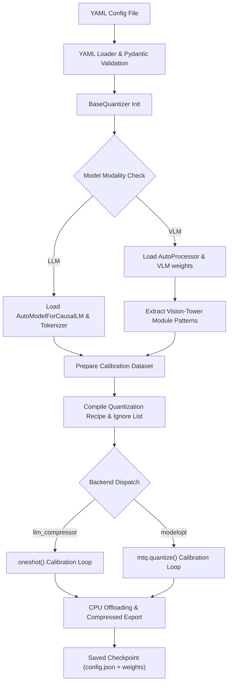
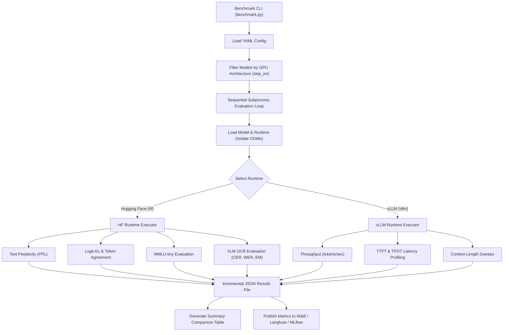

# TripleQuant-VLM

TripleQuant-VLM is a production-grade quantization and benchmarking pipeline designed for Large Language Models (LLMs) and Vision-Language Models (VLMs). It supports state-of-the-art compression techniques—including AWQ, GPTQ, SmoothQuant, FP8, NVFP4, and MXFP4—via a dual-backend architecture built on top of the Neural Magic `llmcompressor` and NVIDIA `modelopt` libraries. The framework provides a unified, YAML-driven interface to manage model loading, calibration, export, and hardware-aware evaluation.

---

## Architectural Overview

TripleQuant-VLM decouples model compression (quantization) from runtime evaluation (benchmarking) through a modular, registry-based codebase.

### Core Modules

* **Configuration Engine** (`src/config/`): Implements strict validation of quantization and benchmarking workloads using Pydantic v2 schemas. YAML configuration files are parsed and checked against semantic constraints before any model is loaded.
* **Quantization Registry** (`src/quantization/`): Implements an abstract `BaseQuantizer` and factory pattern. Quantizers register themselves via a decorator pattern, allowing backend execution paths (`llmcompressor`, `modelopt`, or baseline `fp16`) to be resolved dynamically.
* **Runtime Abstraction Layer** (`src/runtimes/`): Wraps Hugging Face Transformers and vLLM runtimes under a unified execution interface. This allows identical prompts to be routed to different runtimes to compare reference quality vs. production performance.
* **Evaluation Framework** (`src/evaluation/`): Contains isolated modules for language modeling metrics (Perplexity, MMLU-tiny, Logit-KL, Token Agreement) and VLM OCR tasks (Character Error Rate, Word Error Rate, Exact-Match, BLEU).
* **TurboQuant** (`src/turboquant/`): A high-performance KV-cache quantization extension featuring random orthogonal rotations, Lloyd-Max codebook generation, and custom Triton-fused decode attention kernels.

---

## Workflow Diagrams

### Model Quantization Pipeline

This flowchart illustrates the step-by-step process of parsing configuration, routing to the appropriate quantization library, applying modality-aware calibration, and exporting the compressed checkpoints.



### Dual-Runtime Benchmarking & Capability Gating

The benchmarking suite isolates evaluation runs in subprocesses to guarantee crash safety and prevent GPU memory pollution. Metric evaluation is routed dynamically based on runtime capabilities.



---

## Execution Backends & Schemes

The pipeline integrates dual compression engines to maximize compatibility with deployment targets.

| Backend | Supported Methods | Supported Quantization Schemes | Target Runtime Loading Flag |
|---|---|---|---|
| `llm_compressor` | AWQ, GPTQ, PTQ, SmoothQuant | W4A16, W4A16_ASYM, W8A8, W8A16, FP8, FP8_DYNAMIC | `compressed-tensors` |
| `modelopt` | AWQ, PTQ | W4A16, W8A16, W8A8, FP8, FP8_DYNAMIC, FP8_KV, NVFP4, MXFP4, MXFP6, MXFP8, MXINT8 | `modelopt` / `modelopt_fp4` |

### Hardware Compatibility Floors

Different precision formats map to specific NVIDIA microarchitectures:

* **INT4 / INT8 (Marlin / AITER)**: Native support on Turing (RTX 20xx), Ampere (RTX 30xx, A100), Ada Lovelace (RTX 40xx, L40S), Hopper (H100), CDNA3 (AMD MI300X).
* **FP8 (E4M3 / E5M2)**: Native acceleration on Ada Lovelace and Hopper. Emulated with performance penalty on Ampere.
* **NVFP4 / MXFP4**: Native hardware acceleration on Blackwell (B100, RTX 50xx). MXFP4 is emulated on Hopper.

---

## Installation

To prevent PyTorch/Torchvision/CUDA ABI conflicts, it is critical to install pinned packages. Mixing versions will cause runtime failures in custom CUDA kernels.

```bash
# Install matched PyTorch triplet (CUDA 12.8 compatible)
pip install torch==2.8.0 torchvision==0.23.0 torchaudio==2.8.0 \
  --index-url https://download.pytorch.org/whl/cu128

# Core dependencies
pip install "transformers>=4.51,<4.56" "datasets>=3,<4" accelerate pyyaml "pydantic>=2"

# Backend 1: Neural Magic llmcompressor
pip install llmcompressor==0.6.0 compressed-tensors==0.10.2

# Backend 2: NVIDIA ModelOpt (requires torch extras only)
pip install "nvidia-modelopt[torch]==0.44.0"

# Evaluation and OCR metrics
pip install jiwer nltk pillow wandb
```

### Environment Separation Note
Because of CUDA library and compilation conflicts, it is recommended to run the quantization and Hugging Face evaluation steps inside a primary virtual environment, and run the production **vLLM** runtime in a separate, clean virtual environment using:
```bash
pip install "vllm>=0.10,<0.12"
```

---

## 1. Quantizing Models

Run the quantization process by passing a YAML configuration file to the entry-point script:

```bash
python quantize.py --config config/quantize/config_1b_llmcompressor.yaml
```

The script automatically:
1. Validates configuration schemas.
2. Identifies if the model is an LLM or VLM.
3. Automatically excludes VLM vision-tower components (`visual.*`, `vision_tower.*`, etc.) from quantization to prevent severe image representation degradation.
4. Preprocesses the calibration dataset based on configuration format (`chat` or `image_text`).
5. Saves the output model, tokenizer, and configuration files to:
   ```
   {output_dir}/{model_name}-{backend}-{method}-{scheme}/
   ```

### Illustrative Quantization Configuration (`config_1b_llmcompressor.yaml`)

```yaml
method: gptq
backend: llm_compressor

model:
  model_id: TinyLlama/TinyLlama-1.1B-Chat-v1.0
  torch_dtype: bfloat16
  device_map: auto
  model_type: llm

scheme:
  scheme: W8A8
  group_size: 128
  symmetric: true
  observer: mse
  per_channel: false
  targets: ["Linear"]
  ignore: ["lm_head"]

calibration:
  dataset_name: HuggingFaceH4/ultrachat_200k
  split: train_sft
  num_samples: 512
  max_seq_len: 2048
  dataset_format: auto

output:
  output_dir: ./output
  save_compressed: true
  save_processor: true

smoothquant:
  enabled: true
  strength: 0.5

gptq:
  dampening_frac: 0.01
```

---

## 2. Testing a Quantized Model

Load and run basic generations with a quantized checkpoint to measure disk footprint, memory consumption, loading time, and output token rates:

```bash
# Auto-detect compressed format and generate text
python tests/simple_generate.py --model ./output/TinyLlama-1.1B-Chat-v1.0-llm_compressor-gptq-W8A8

# Compare generation output side-by-side with FP16 baseline
python tests/simple_generate.py \
  --model ./output/TinyLlama-1.1B-Chat-v1.0-llm_compressor-gptq-W8A8 \
  --baseline TinyLlama/TinyLlama-1.1B-Chat-v1.0

# Start interactive CLI chat
python tests/simple_generate.py \
  --model ./output/TinyLlama-1.1B-Chat-v1.0-llm_compressor-gptq-W8A8 \
  --interactive
```

---

## 3. Benchmarking Framework

Run complex evaluation suites comparing multiple models across Hugging Face and vLLM runtimes.

```bash
# Evaluate text LLM perplexity, MMLU-tiny, latency and memory throughput
python benchmark.py -c config/benchmark/llm_comparison.yaml

# Evaluate VLM OCR accuracy (CER, WER, EM, BLEU) and memory statistics
python benchmark.py -c config/benchmark/ocr_comparison.yaml

# Dry-run validation to preview the benchmark schedule without loading models
python benchmark.py -c config/benchmark/llm_comparison.yaml --dry-run
```

### Metrics Routing Logic

* **Hugging Face (`hf`) Runtime**: Computes logits-dependent quality metrics (Perplexity, Logit-KL Divergence, Token Agreement) and VLM generation metrics (OCR metrics).
* **vLLM (`vllm`) Runtime**: Profiling target for production metrics (Time-to-First-Token (TTFT), Time-Per-Output-Token (TPOT), batch size scaling, and maximum context sweeps).

Local results are exported incrementally in JSON format. When experiment tracking is enabled (`TrackingConfig.enabled: ["wandb", "mlflow"]`), results are automatically uploaded to W&B runs and registered as MLflow run artifacts.

---

## Serving with vLLM

To serve your quantized checkpoints in production, start vLLM with the appropriate quantization flag:

```bash
# llmcompressor output (compressed-tensors format)
vllm serve ./output/TinyLlama-W8A8 --quantization compressed-tensors

# ModelOpt FP8 output (Hopper/Ada only)
vllm serve ./output/Qwen2.5-VL-7B-FP8 --quantization modelopt

# ModelOpt NVFP4 output (Blackwell only)
vllm serve ./output/model-nvfp4 --quantization modelopt_fp4
```

---

## TurboQuant: Custom KV-Cache Compression

The attention mechanism in Transformers is memory-bandwidth bound during the decode phase. In long-context tasks, storing the Keys and Values (KV-cache) in high-precision (FP16/BF16) creates a severe VRAM bottleneck. 

Standard quantization algorithms minimize reconstruction error (MSE) per vector. However, attention operations only consume Key-Value pairs through inner products ($\langle q, k \rangle$) and weighted sums ($\sum p_i v_i$). TurboQuant is designed specifically to minimize the distortion of the **inner product**, rather than the isolated weights.

### Mathematical Foundation

#### 1. Random Orthogonal Rotation ($\Pi$)
Let $x \in \mathbb{R}^d$ be a Key or Value vector (where $d = \text{head\_dim}$, typically 128). We apply a fixed random orthogonal rotation matrix $\Pi \in \mathbb{R}^{d \times d}$ generated using a QR decomposition of a random Gaussian matrix:

$$y = \Pi \left( \frac{x}{\|x\|_2} \right)$$

Because $\Pi$ is orthogonal, it is norm-preserving and preserves inner products:

$$\|y\|_2 = 1 \quad \text{and} \quad \langle \Pi a, \Pi b \rangle = \langle a, b \rangle$$

The coordinate projections $y_i$ represent the marginals of a uniform point on a unit sphere. For large dimension $d$, these coordinates converge to a Gaussian distribution:

$$y_i \sim \mathcal{N}\left(0, \frac{1}{d}\right)$$

This transformation flattens outliers. The coordinates are outlier-free and follow a known distribution, removing the need for dynamic per-channel or per-token scale factors.

#### 2. Lloyd-Max Quantization
Using the static probability density function (PDF) of the rotated coordinates, we optimize a global codebook containing $2^b$ centroids $\{c_1, \dots, c_{2^b}\}$ using Lloyd-Max quantization iterations to minimize MSE distortion:

$$\mathbb{E}_{y \sim f} \left[ (y - Q(y))^2 \right]$$

Since the coordinate distribution is identical across all layers, a single static codebook is cached and utilized globally.

#### 3. Quantized Johnson-Lindenstrauss (QJL) 1-Bit Correction
To correct the quantization residual $r = x - \hat{x}_{\text{MSE}}$, TurboQuant projects the residual using a random Gaussian sketching matrix $S \in \mathbb{R}^{d \times d}$:

$$s = S \cdot r$$

It packs the sign bits $\text{sign}(s) \in \{-1, +1\}^d$ (1 bit per coordinate) and stores the residual norm $\|r\|_2$ as a single FP16 scalar. The inner product is estimated via:

$$\langle q, x \rangle \approx \langle q, \hat{x}_{\text{MSE}} \rangle + \frac{\sqrt{\pi/2}}{d} \|r\|_2 \langle S q, \text{sign}(S r) \rangle$$

The constant scaling factor ensures that the QJL adjustment is an unbiased estimator of the quantization error projection.

### Fused attention score (No Materialization)
During generation, we do not reconstruct the high-precision cache vectors. Instead, the query vector is rotated forward once:

$$q_{\text{rot}} = q \cdot \Pi$$

The attention score calculation for a key index $idx$ is calculated as a streaming dot product:

$$\text{score} = \|k\|_2 \sum_{j=1}^d q_{\text{rot}}[j] \cdot \text{codebook}[idx[j]]$$

This allows the custom Triton kernels to load packed integer indexes directly from HBM, lookup centroids, and accumulate scores in SRAM without writing intermediate dequantized vectors back to memory.

### Design Trade-Off: MSE-Only vs. MSE+QJL
Empirical analysis indicates that while the QJL correction makes the inner product estimator unbiased, the variance introduced by the random projection can degrade generation accuracy in real-world workloads compared to using pure Lloyd-Max MSE coordinates. Therefore, the pipeline defaults to **MSE-only** quantization, exposing QJL optimization via a `--use-qjl` CLI flag.

---

## Extensibility Guide

### Adding a New Quantization Method
To implement a custom compression strategy, subclass `BaseQuantizer` and use the registry decorator:

```python
# src/quantization/custom_method.py
from src.quantization.registry import register
from src.quantization.base import BaseQuantizer

@register("custom_precision")
class CustomQuantizer(BaseQuantizer):
    def quantize(self) -> None:
        # 1. Load model and tokenizer via helper methods
        self.load_model()
        
        # 2. Implement quantization math/API call here
        # ...
        
        # 3. Export weights and configurations
        self.save(str(self.config.output.output_dir))
```

Add the string key `"custom_precision"` to the configuration schemas in `src/config/schemas.py`. The factory module will automatically pick up the new quantizer.

---

## Roadmap

### Completed Milestones
* **Pydantic Validation**: Implemented schema structures and loaders.
* **Dual Backend Support**: Fully integrated `llmcompressor` and `modelopt` APIs.
* **Modality-Aware Calibration**: Configured automatic vision-tower exclusion and VLM dataset template processing.
* **Crash-Safe Evaluation Harness**: Designed subprocess-isolated test scripts measuring PPL, MMLU, CER, WER, and execution speeds.
* **Serving**: Verified compatibility with vLLM's `compressed-tensors` and `modelopt` model loading.

### In Progress
* **Tracking Integrations**: Wiring the experiment tracking module to connect Langfuse trace sessions for OCR samples, W&B metrics tables, and MLflow model registries.
* **TurboQuant Correctness**: Fixing the `RotateMatirx` vs `self.Pi` buffer registration mismatch in the PyTorch reference implementation.
* **Custom Triton Kernels**: Developing fused MSE attention and decode-step Triton operations.

### Planned / v2 Scope
* **Pruning and Sparsity**: Integrating structured 2:4 sparsity patterns.
* **Distillation**: Post-training knowledge distillation pipelines.
* **TensorRT-LLM Export**: Direct compilation of modelopt check-pointing files to TRT engines.

---

## License

This project is licensed under the Apache 2.0 License. See the LICENSE file for details.
