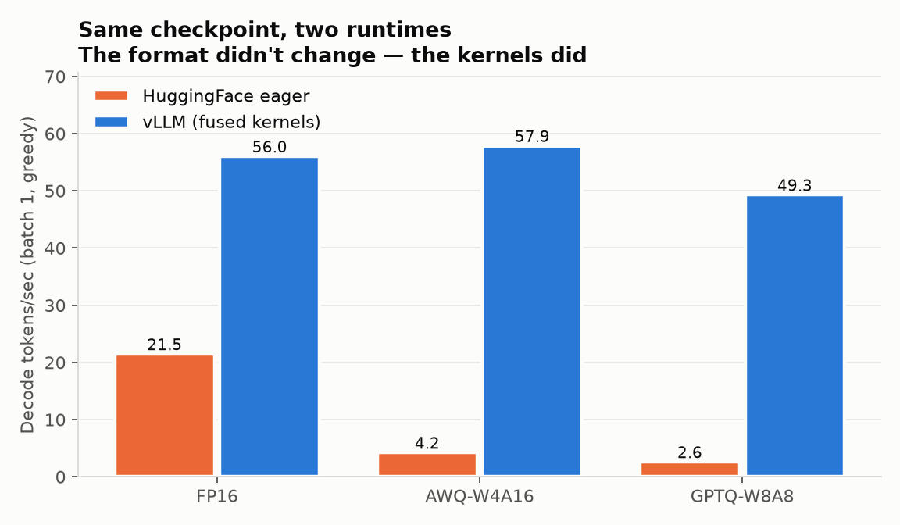
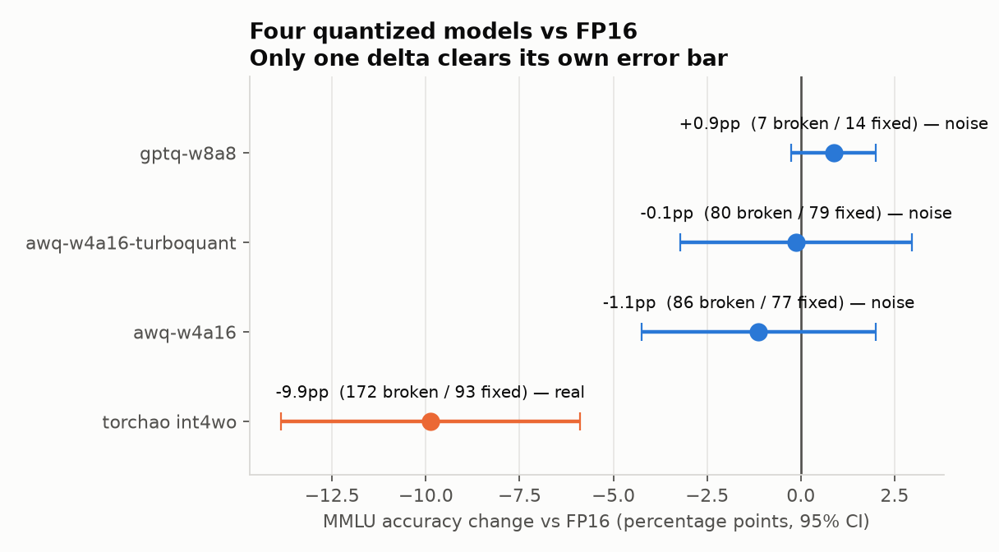
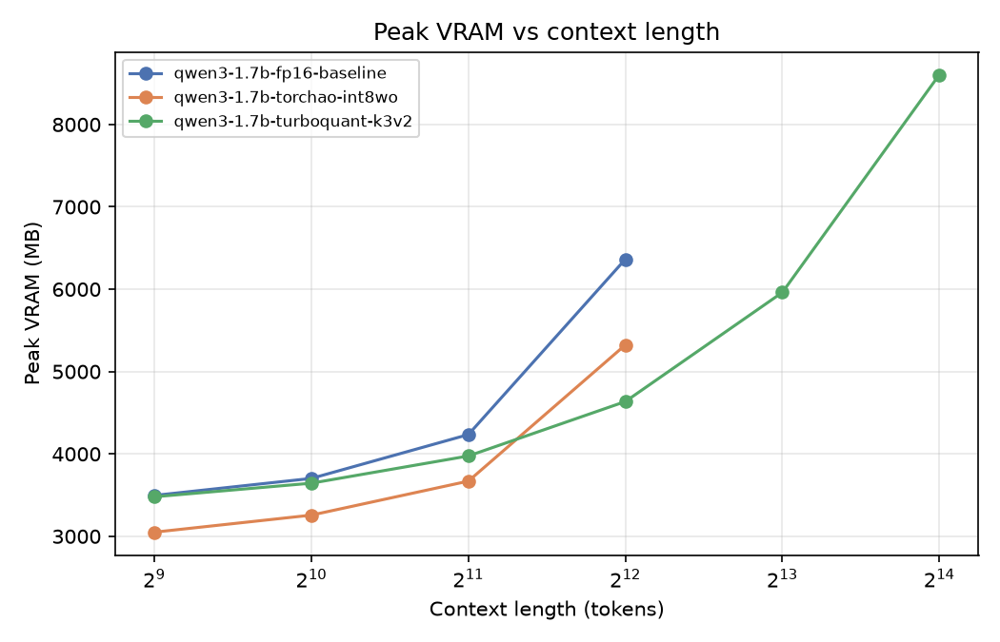
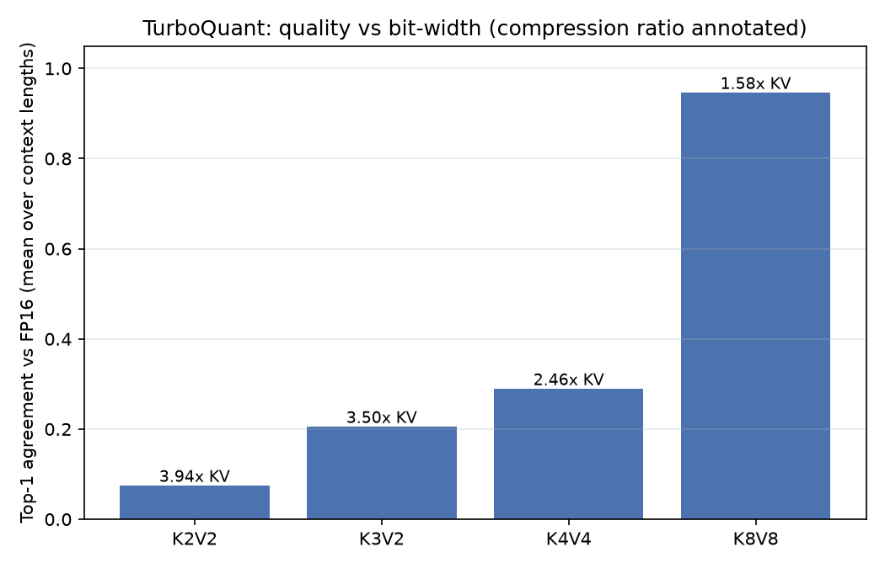
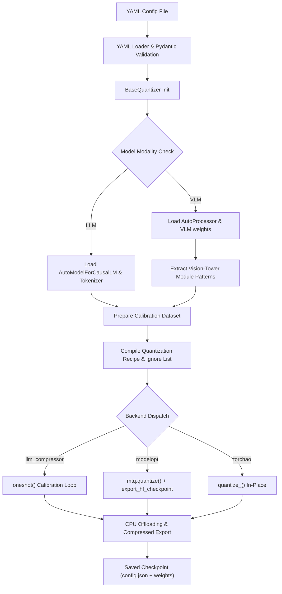
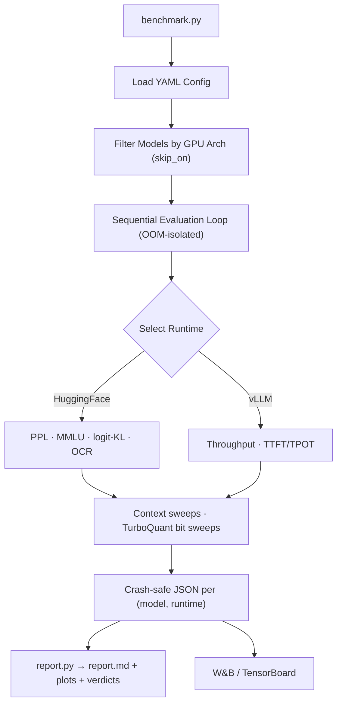

# TripleQuant-VLM

**Benchmark, compare, and evaluate quantization methods and inference engines across models, hardware, and workloads.**

TripleQuant-VLM quantizes LLMs and VLMs through three backends (`llm_compressor`,
NVIDIA `modelopt`, PyTorch `torchao`), runs them through HuggingFace and vLLM runtimes,
and measures what actually changed — latency, throughput, memory, and quality — so the
answer to "which quantization method should I use" is a number, not a guess. It also
ships **TurboQuant**, a from-scratch KV-cache compression scheme (random rotation +
Lloyd-Max codebook), because weight quantization alone doesn't touch the thing that
actually runs out first at long context: the KV cache.

Every number below was measured by this repo on one machine. Nothing is imported from a
paper or a vendor benchmark.

---

## Results — Qwen3-1.7B on an RTX 3060 (12 GB)

**Environment:** RTX 3060 12 GB (sm_86, Ampere) · driver 610.62 · CUDA 12.8 ·
torch 2.8.0+cu128 · transformers 4.55.4 · vLLM 0.11.2 (WSL2) · Windows 10.

### The headline: the runtime decides quantization's speed, not the format



| Config | Decode TPS (HF eager) | Decode TPS (vLLM) | VRAM (GB) | PPL | MMLU (n=800) |
|---|---|---|---|---|---|
| FP16 baseline | 21.5 | 56.1 | 3.28 | 22.45 | 0.5337 |
| llmcompressor AWQ-W4A16 | 4.3 | **57.9** | 1.30 | 37.81 (+15.4) | 0.5225 (−1.1pp, ns) |
| llmcompressor GPTQ-W8A8 | 2.6 | 49.3 | 1.95 | 22.72 (+0.27) | 0.5425 (+0.9pp, ns) |
| modelopt FP8 | can't execute¹ | can't execute¹ | 1.95 | — | — |
| torchao int4wo | 17.3 | — | 1.47 | 36.46 (+14.0) | 0.4350 (**−9.9pp, real**) |
| AWQ-W4A16 + TurboQuant KV | 4.3 | — | 1.30 | 37.85 (+15.4)² | 0.5325 (−0.1pp, ns) |

The **same AWQ-W4A16 checkpoint** runs at 4.3 tok/s under HuggingFace eager and 57.9
tok/s under vLLM — **13.6x, weights unchanged**, and faster than FP16 itself. Eager mode
dequantizes to a bf16 tensor and writes it back to HBM for every matmul, spending exactly
the bandwidth the 4-bit weights saved; vLLM's Marlin kernels fuse dequantization into the
matmul so the bf16 tensor is never materialized. **Never conclude a format is slow from
an eager-mode benchmark** — you measured your runtime's kernel coverage.

Memory savings, by contrast, are real on both runtimes (1.30 GB vs 3.28 GB).

¹ *FP8 needs compute capability sm_89 (Ada); this box is sm_86. The checkpoint exports
correctly — verified by vLLM's error moving from "cannot find the config file for
modelopt" (a repo bug, since fixed) to a hardware-capability rejection. NVFP4 needs
Blackwell. TensorRT-LLM has no supported path on this Windows/WSL setup.*
² *Teacher-forced PPL cannot observe KV-cache quantization — see "What the metrics can
and can't see" below.*

### "ns" means the difference is not statistically significant

MMLU here is 800 questions with a paired **McNemar exact test** against the FP16
baseline — every model answers identical questions, so the discordant pairs are the
signal, not two independent accuracy figures.



| Model | Δ | broken / fixed | p | |
|---|---|---|---|---|
| GPTQ-W8A8 | +0.9pp | 7 / 14 | 0.19 | noise |
| AWQ + TurboQuant | −0.1pp | 80 / 79 | 1.00 | noise |
| AWQ-W4A16 | −1.1pp | 86 / 77 | 0.53 | noise |
| torchao int4wo | −9.9pp | 172 / 93 | **<0.0001** | real |

The discordant counts are more informative than the deltas. AWQ changes **163 of 800
answers** but *symmetrically* (86 broken, 77 fixed) — heavy perturbation, no net accuracy
change. int4wo changes 265 *asymmetrically* (172/93) — genuine degradation. Same "4-bit
weights" label, different mechanism. Reproduce with:

```bash
python scripts/mmlu_significance.py --dir results/qwen3-1.7b-leaderboard
```

### TurboQuant: 4x context, at a bit-width that preserves quality

| Model | Max context, this GPU | Top-1 agreement vs FP16 @16K |
|---|---|---|
| fp16 baseline | 4,096 tokens | — (reference) |
| torchao int8wo | 4,096 tokens | n/a (weight-only) |
| **TurboQuant K8V8** | **16,384 tokens (4x)** | **0.918 — quality preserved** |
| TurboQuant K3V2 | 16,384 tokens | 0.193 — fits, but output diverges badly |



**Read the two TurboQuant rows together — that contrast is the finding.** Both reach 4x
fp16's context, so capacity alone doesn't distinguish them; the agreement column does.
K8V8 keeps 92% next-token agreement while compressing the KV cache 1.73x — the setting
worth shipping. K3V2 compresses 4.81x, buys *no additional context*, and gives up ~80% of
fidelity.



| Bits | Top-1 agreement (512 → 16K) | KV compression @16K |
|---|---|---|
| K2V2 | 0.105 → 0.082 | 5.65x |
| K3V2 | 0.266 → 0.193 | 4.81x |
| K4V4 | 0.402 → 0.307 | 3.02x |
| **K8V8** | **0.981 → 0.918** | 1.73x |

Two further results: **the cliff is between K4V4 and K8V8**, not gradual — everything
below 8 bits lands under 40% agreement, so the aggressive-compression band is mostly
unusable on this model. And **agreement doesn't decay with context** at any bit-width
(K3V2 is as poor at 512 as at 16K) — the constraint is the bit budget, not long context.

Root cause of the low-bit collapse: keys are quantized per-vector with one global
codebook, but transformer keys have large-magnitude outlier *channels*. The known fix is
per-channel key quantization (KIVI-style) — a quantizer redesign, not done here.

*Measurement caveat:* "max context" is the longest sequence a single full-prefill forward
pass fits in 12 GB, and that peak is dominated by the all-position logits tensor rather
than the KV cache. Valid as a **relative** comparison under an identical probe (only the
KV codec differs); not a serving-capacity figure.

---

## What the metrics can and can't see

Three claims in earlier versions of this README were wrong — not miscalculated, but
*structurally unsupported*. Each is worth knowing before you trust any quantization
benchmark, including this one.

1. **Teacher-forced perplexity cannot observe KV-cache quantization.** PPL scores a whole
   sequence in one forward pass; the cache is written and never read back across steps.
   A compressed and uncompressed model scored bit-identical PPL to 16 decimals here —
   that was the metric being blind, not the codec being lossless. Use generation-based
   agreement instead.
2. **An accuracy ratio without its sample size is unfalsifiable.** MMLU was originally
   n=250 (SE ±3.1pp), so "quantization improved accuracy" was 2–3 questions flipping. The
   eval now returns `{acc, correct, total, stderr, per_question}` and the count is
   config-driven.
3. **A memory probe says nothing about output quality.** The "4x context" number came from
   a capacity sweep with no accuracy field at all, while the quality sweep stopped at
   4,096 — below the claim. The two axes never overlapped. Extending quality measurement
   to 16,384 is what revealed K8V8, not K3V2, as the shippable setting.

Common structure: **a metric that couldn't see what it was being used to claim.** If a
quantized model appears to beat its own baseline, that's the null hypothesis, not a
discovery.

---

## TurboQuant: Custom KV-Cache Compression

The decode phase of transformer inference is memory-bandwidth bound: at long context, the
Key-Value cache in fp16/bf16 becomes the dominant VRAM cost, not the model weights.
Standard quantization minimizes per-vector reconstruction error (MSE). But attention only
ever consumes K/V through inner products (`⟨q, k⟩`) and weighted sums (`Σ pᵢvᵢ`) —
TurboQuant is designed to minimize distortion of the **inner product**, not the isolated
weights.

### Mathematical foundation

**1. Random orthogonal rotation (Π).** Let `x ∈ ℝᵈ` be a Key or Value vector (`d` =
head_dim, typically 128). Apply a fixed random orthogonal rotation `Π ∈ ℝᵈˣᵈ` (QR
decomposition of a random Gaussian matrix):

$$y = \Pi \left( \frac{x}{\|x\|_2} \right)$$

`Π` is norm- and inner-product-preserving (`⟨Πa, Πb⟩ = ⟨a, b⟩`). For large `d`, the
rotated coordinates converge to `y_i ~ N(0, 1/d)` — outlier channels get flattened into a
known, fixed distribution, removing the need for dynamic per-channel/per-token scales.

**2. Lloyd-Max quantization.** Using the static PDF of the rotated coordinates, optimize a
global codebook of `2^b` centroids via Lloyd-Max iterations to minimize
`E[(y - Q(y))²]`. Since the coordinate distribution is identical across layers, a single
static codebook is cached and reused globally.

**3. QJL 1-bit residual correction (available, off by default).** Projects the
quantization residual `r = x - x̂_MSE` through a random Gaussian sketch `S`, packs
`sign(Sr)` (1 bit/coordinate), and stores `‖r‖₂` as one fp16 scalar. In principle this
makes the inner-product estimate unbiased — in practice it is **off by default**, because
measurement showed it produces *identical* scores to dequantize-then-matmul: the two are
algebraically equivalent for a fixed projection `S`, and QJL's benefit is variance
reduction in expectation over *resampled* `S`. This implementation fixes `S` once for
speed, so the extra bit buys nothing.

**4. Fused attention score (no materialization).** The query is rotated once
(`q_rot = q·Π`); the score for a cached key is a streaming dot product against packed
codebook indices —

$$\text{score} = \|k\|_2 \sum_{j=1}^d q_{\text{rot}}[j] \cdot \text{codebook}[idx[j]]$$

— so a fused kernel could stream packed indices from HBM, gather centroids, and
accumulate in SRAM without ever writing a dequantized vector back to memory. **Not yet
built** — every TurboQuant latency number above runs on the unfused PyTorch reference
path, 5–10x slower than a fused kernel would be. The memory results are unaffected.

---

## Decision Matrix

What's actually implemented and measured here — not a hypothetical feature list.

| Need | Use | Why |
|---|---|---|
| Longest context on fixed VRAM | **TurboQuant K8V8** | KV cache is what runs out first at long context; weight quantization doesn't touch it. Check the bit-width tradeoff above before going below 8 bits. |
| Smallest resident weight footprint, simplest setup | **torchao int8wo** | One dependency, on-the-fly or offline, −31% VRAM with quality within noise of fp16. |
| Broadest scheme coverage (FP8, NVFP4, MXFP4) | **ModelOpt** | The only backend here targeting Blackwell-generation formats; also an AWQ/PTQ path with per-layer `quant_cfg`. Needs Ada+ to actually serve FP8. |
| Production serving throughput | **llm_compressor → vLLM** (`compressed-tensors`) | AWQ/GPTQ/PTQ/SmoothQuant, native vLLM loading with fused kernels, no export step. This is where quantization actually pays. |
| VLM / OCR workload | **llm_compressor or ModelOpt** | Both auto-exclude vision-tower modules from calibration — quantizing the vision tower degrades image understanding badly. |
| Maximum accuracy | **fp16 baseline** | The reference every other row is measured against. |

## Compatibility Matrix

| Backend | HF runtime | vLLM | Notes |
|---|---|---|---|
| `llm_compressor` | ✅ | ✅ (`--quantization compressed-tensors`) | AWQ, GPTQ, PTQ, SmoothQuant |
| `modelopt` | ✅ | ✅ (`--quantization modelopt` / `modelopt_fp4`) | AWQ, PTQ; FP8/NVFP4/MXFP4. FP8 serving needs sm_89+ |
| `torchao` | ✅ | ❌ not wired | Offline checkpoint uses `safe_serialization=False` (tensor subclasses) — no vLLM loader path built |
| TurboQuant (KV cache) | ✅ (single-sequence decode) | ❌ not integrated | v2 item; would need a vLLM attention backend |

---

## Architecture

Model compression is decoupled from runtime evaluation through a modular,
registry-based codebase.

* **Configuration** (`src/config/`) — Pydantic v2 schemas validate quantization and
  benchmark YAML before any model loads.
* **Quantization registry** (`src/quantization/`) — `BaseQuantizer` + factory; backends
  (`llm_compressor`, `modelopt`, `torchao`, `fp16` baseline) register via decorator and
  resolve dynamically from `backend` in the config.
* **Runtime abstraction** (`src/runtimes/`) — HF and vLLM under one interface, so the
  same prompts run through both.
* **Evaluation** (`src/evaluation/`) — LLM metrics (perplexity, MMLU with per-question
  detail, logit-KL, token agreement) and VLM/OCR metrics (CER, WER, exact-match, BLEU).
* **TurboQuant** (`src/turboquant_v1/`) — the KV-cache compression extension above.
* **Reporting** (`src/reporting/`) — turns `results/*.json` into `report.md` + charts +
  BEST-FOR verdicts.
* **Tracking** (`src/tracking/`) — W&B + TensorBoard, additive to local JSON.

### Model Quantization Pipeline



### Dual-Runtime Benchmarking & Capability Gating

Evaluation runs are isolated for crash safety and clean GPU memory between models.
Metric routing respects runtime capabilities — perplexity needs raw logits (HF only),
OCR needs VLM inference, perf/memory run on both.



### Execution Backends & Schemes

| Backend | Methods | Schemes | Loading Flag |
|---|---|---|---|
| `llm_compressor` | AWQ, GPTQ, PTQ, SmoothQuant | W4A16, W4A16_ASYM, W8A8, W8A16, FP8, FP8_DYNAMIC | `compressed-tensors` |
| `modelopt` | AWQ, PTQ | W4A16, W8A16, W8A8, FP8, FP8_DYNAMIC, FP8_KV, NVFP4, MXFP4, MXFP6, MXFP8, MXINT8 | `modelopt` / `modelopt_fp4` |
| `torchao` | PTQ (weight-only / dynamic) | W8A16, W4A16, W4A16_ASYM, W8A8, FP8, FP8_DYNAMIC | reload via `from_pretrained` |

### Hardware Compatibility Floors

* **INT4/INT8:** Turing+, Ampere, Ada, Hopper, CDNA3 — native.
* **FP8 (E4M3/E5M2):** Ada/Hopper native. On Ampere the HF/torch path *emulates* it
  (slow but runs); **vLLM refuses to load it** (`Minimum capability: 89`).
* **NVFP4/MXFP4:** Blackwell native; MXFP4 emulated on Hopper; no path on Ampere.

---

## Installation

PyTorch/torchvision/CUDA ABI must stay matched — mixing versions breaks custom CUDA
kernels.

```bash
# Matched PyTorch triplet (CUDA 12.8)
pip install torch==2.8.0 torchvision==0.23.0 torchaudio==2.8.0 \
  --index-url https://download.pytorch.org/whl/cu128

# Core dependencies
pip install "transformers>=4.51,<4.56" "datasets>=3,<4" accelerate pyyaml "pydantic>=2"

# Backend 1: llmcompressor (base dependency)
pip install llmcompressor==0.6.0 compressed-tensors==0.10.2

# Backend 2: NVIDIA ModelOpt (optional extra)
pip install -e ".[modelopt]"

# Backend 3: torchao (optional extra)
pip install -e ".[torchao]"

# Evaluation, tracking, plots
pip install jiwer nltk pillow wandb matplotlib
```

**vLLM lives in its own environment** — its pins drift out of sync with the quantization
stack's on a different release cadence. In a separate venv:

```bash
pip install -e ".[vllm]"   # vllm>=0.10,<0.12
```

`setup.bat` (Windows) / `setup.sh` (Linux) automate the primary environment.

---

## Usage

### 1. Quantize

```bash
python quantize.py --config config/quantize/qwen3_1_7b/llmc_awq_w4a16.yaml
```

Validates config, detects LLM vs VLM, auto-excludes vision-tower components from
calibration, and saves to `{output_dir}/{model}-{backend}-{method}-{scheme}/`.

<details>
<summary>Example config</summary>

```yaml
method: awq
backend: llm_compressor

model:
  model_id: Qwen/Qwen3-1.7B
  torch_dtype: bfloat16
  device_map: auto
  model_type: llm

scheme:
  scheme: W4A16
  group_size: 128
  symmetric: true
  observer: mse
  targets: ["Linear"]
  ignore: ["lm_head"]

calibration:
  dataset_name: HuggingFaceH4/ultrachat_200k
  split: train_sft
  num_samples: 128
  max_seq_len: 2048

output:
  output_dir: ./outputs/qwen3-1.7b/awq-w4a16
  save_compressed: true
```
</details>

### 2. Smoke-test a checkpoint

```bash
python tests/simple_generate.py --model ./outputs/qwen3-1.7b/awq-w4a16/<subdir>
python tests/simple_generate.py --model <quantized> --baseline Qwen/Qwen3-1.7B
```

### 3. Benchmark

```bash
python benchmark.py -c config/benchmark/qwen3_1_7b_leaderboard.yaml   # full comparison
python benchmark.py -c config/benchmark/qwen3_1_7b_tq_quality.yaml    # TQ quality vs context
python benchmark.py -c config/benchmark/qwen3_1_7b.yaml --dry-run     # validate only
```

Results save incrementally as JSON to `results/<run_name>/`, with a full environment
snapshot (GPU, driver, CUDA, torch, git commit) in every file.

### 4. Report

```bash
python report.py --dir results/<run_name>                        # report.md + plots + verdicts
python scripts/mmlu_significance.py --dir results/<run_name>     # paired McNemar test
python scripts/wandb_leaderboard.py --dir results/<run_name>     # consolidated W&B view
```

### 5. Serve

```bash
vllm serve ./outputs/qwen3-1.7b/awq-w4a16/<subdir> --quantization compressed-tensors
vllm serve ./outputs/<model>-FP8 --quantization modelopt          # needs sm_89+
```

---

## Extensibility

Subclass `BaseQuantizer`, register with a decorator:

```python
# src/quantization/custom_method.py
from src.quantization.registry import register
from src.quantization.base import BaseQuantizer

@register("custom_precision")
class CustomQuantizer(BaseQuantizer):
    def quantize(self) -> None:
        self.load_model()
        # quantization math / API call here
        self.save(str(self.config.output.output_dir))
```

Add `"custom_precision"` to `BackendLiteral` in `src/config/schemas.py` — the factory
picks it up automatically.

---

## Roadmap

### Shipped (v1)

* Pydantic-validated config, registry-based quantizer/runtime dispatch
* Three quantization backends + fp16 baseline
* Modality-aware calibration (automatic vision-tower exclusion for VLMs)
* Crash-safe dual-runtime benchmark harness — PPL, MMLU (with per-question detail and
  paired significance testing), OCR, TTFT/TPOT, throughput, context sweeps, TurboQuant
  bit-width sweeps
* TurboQuant KV-cache compression (PyTorch reference) with HF `generate` integration
* W&B + TensorBoard tracking, environment provenance on every result
* Report generator, statistical-significance tooling
* Windows VRAM-oversubscription measurement guard

### v2 backlog

Ordered by value; each is a real gap, not a wish.

1. **Wire `logit_kl` + `token_agree`** — the functions exist and work; only the baseline
   capture loop is missing. They're the right metrics for weight quantization (paired,
   per-token, far more sensitive than MMLU accuracy).
2. **Production serving metrics** — every latency number here is single-request
   closed-loop. Missing: ITL distribution, E2E percentiles, async open-loop load harness
   with Poisson arrivals, **goodput**, QPS sweep and saturation knee.
3. **Run the untested model families** — configs exist and validate for
   Qwen3-4B-Thinking and HunyuanOCR but have never been executed. The 4B family also
   tests whether the "+15.4 PPL from 4-bit" result is small-model-specific.
4. **Weight-quant quality vs context length** — unmeasured. PPL uses fixed-size chunks,
   MMLU prompts are short. The same blind spot that produced this project's largest
   correction, unexamined for weight quantization.
5. **Per-channel key quantization (KIVI-style)** — the identified fix for TurboQuant's
   low-bit collapse; would move K3V2 from unusable toward shippable.
6. **TurboQuant Triton kernels** — fused MSE score and fused decode with online softmax.
   Converts the banked memory win into a latency win.
7. **TurboQuant × vLLM** — needs a real attention backend; without it TQ can't be
   measured on the runtime where quantization actually performs.
8. **FP8 / NVFP4 / TensorRT-LLM on Ada+ hardware** — checkpoints are correct; the GPU is
   the only blocker.

---

## License

Apache 2.0. See `LICENSE`.
