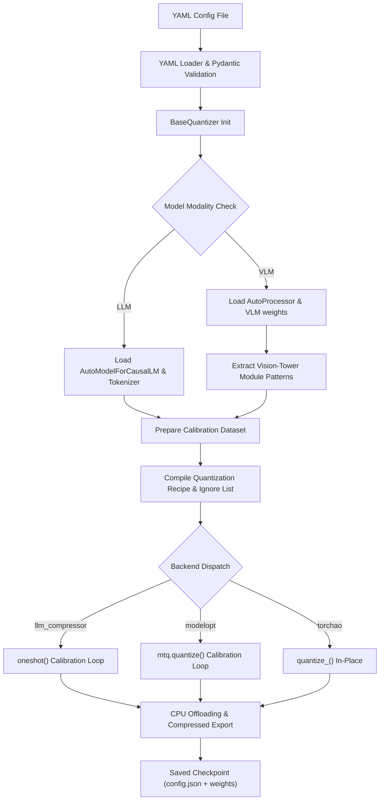
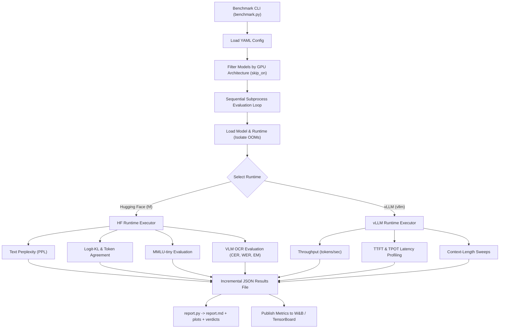

# TripleQuant-VLM

**Benchmark, compare, and evaluate quantization methods and inference engines across models, hardware, and workloads.**

TripleQuant-VLM quantizes LLMs and VLMs through three backends (`llm_compressor`,
NVIDIA `modelopt`, PyTorch `torchao`), runs them through HuggingFace and vLLM runtimes,
and measures what actually changed — latency, throughput, memory, and quality — so the
answer to "which quantization method should I use" is a number, not a guess. It also
ships **TurboQuant**, a from-scratch KV-cache compression scheme (random rotation +
Lloyd-Max codebook), because weight quantization alone doesn't touch the thing that
actually runs out first at long context: the KV cache.

---

## Results

Qwen3-1.7B, RTX 3060 (12GB). Full report with methodology and every metric:
[`docs/benchmark_report.md`](docs/benchmark_report.md) — regenerate any sweep into the
same format with `python report.py --dir results/<run_name>`.

**One model, every quantization path, HF + vLLM serving, one table:**
[`docs/qwen3_1_7b_leaderboard.md`](docs/qwen3_1_7b_leaderboard.md) — including two real
bugs found and fixed along the way (a torchao int4 kernel-packing gap, a ModelOpt export
that silently dropped quant metadata) and one still open (vLLM verification of the fixed
FP8 export, blocked on a WSL disk repair, documented rather than hidden). Headline: the
same AWQ-W4A16 checkpoint runs 4.2 TPS on HF eager and 57.9 TPS under vLLM's Marlin
kernels — faster than fp16.

| Model | TTFT (ms) | TPOT (ms) | VRAM (MB) | PPL | MMLU |
|---|---|---|---|---|---|
| fp16 baseline | 51.5 | 49.4 | 3,282 | 22.45 | 0.548 |
| torchao int8wo | 70.2 | 66.1 | 2,250 (-31%) | 21.98 | 0.556 |
| TurboQuant K3V2 | 71.4 | 40.6 | 3,290\* | 22.45 | 0.564\* |

\* *Short-context snapshot — see below, this metric is measuring the wrong thing for a
KV-cache technique. \* MMLU delta is noise (small sample), not a real quality difference —
[explained in the report](docs/benchmark_report.md).*

**The number that matters for a KV-cache codec isn't short-context VRAM — it's how far
context can grow before the cache exhausts the GPU:**

| Model | Max usable context, this GPU |
|---|---|
| fp16 baseline | 4,096 tokens |
| torchao int8wo | 4,096 tokens (same bucket as fp16 — see note) |
| **TurboQuant K3V2** | **16,384 tokens (4x fp16/torchao)** |


Note: torchao's smaller resident-weight footprint does buy real headroom at every
matched context length (e.g. 5,324 MB vs fp16's 6,364 MB at 4,096 tokens) — it just isn't
enough to survive the *next* doubling step in this sweep's grid (512/1024/.../16384): both
land over the 12,288 MB card's capacity at 8,192 tokens (torchao 13,134 MB, fp16
14,174 MB). A finer-grained sweep would likely find torchao's true ceiling somewhere
between 4,096 and 8,192, higher than fp16's — but that hasn't been measured, so it isn't
claimed here. TurboQuant's KV compression is a different kind of win (bytes-per-token
that shrinks with the codec, not a fixed offset), which is why it's the only one crossing
multiple doubling steps.

This didn't come for free — TurboQuant's default (3-bit keys, 2-bit values) trades quality
for that ratio, and the honest version of that tradeoff is reported, not hidden:


At K3V2, next-token agreement with FP16 is 9-19% (value-bit precision is the bottleneck,
not key-bit — K2V2 and K3V2 score within noise of each other). K8V8 is near-lossless
(~97-98%) at a more modest 1.3-1.7x compression. Full tradeoff table, root cause, and the
real fix (per-channel key quantization) in
[`docs/failure_cases.md`](docs/failure_cases.md#2-turboquants-default-k3v2-has-weak-next-token-agreement-at-low-bit-widths).

---

## TurboQuant: Custom KV-Cache Compression

The decode phase of transformer inference is memory-bandwidth bound: at long context, the
Key-Value cache in fp16/bf16 becomes the dominant VRAM cost, not the model weights.
Standard quantization minimizes per-vector reconstruction error (MSE). But attention only
ever consumes K/V through inner products (`⟨q, k⟩`) and weighted sums (`Σ pᵢvᵢ`) —
TurboQuant is designed to minimize distortion of the **inner product**, not the isolated
weights.

### Mathematical foundation

**1. Random orthogonal rotation (Π).** Let `x ∈ ℝᵈ` be a Key or Value vector (`d` =
head_dim, typically 128). Apply a fixed random orthogonal rotation `Π ∈ ℝᵈˣᵈ` (QR
decomposition of a random Gaussian matrix):

$$y = \Pi \left( \frac{x}{\|x\|_2} \right)$$

`Π` is norm- and inner-product-preserving (`⟨Πa, Πb⟩ = ⟨a, b⟩`). For large `d`, the
rotated coordinates converge to `y_i ~ N(0, 1/d)` — outlier channels get flattened into a
known, fixed distribution, removing the need for dynamic per-channel/per-token scales.

**2. Lloyd-Max quantization.** Using the static PDF of the rotated coordinates, optimize a
global codebook of `2^b` centroids via Lloyd-Max iterations to minimize
`E[(y - Q(y))²]`. Since the coordinate distribution is identical across layers, a single
static codebook is cached and reused globally.

**3. QJL 1-bit residual correction (available, off by default).** Projects the
quantization residual `r = x - x̂_MSE` through a random Gaussian sketch `S`, packs
`sign(Sr)` (1 bit/coordinate), and stores `‖r‖₂` as one fp16 scalar. In principle this
makes the inner-product estimate unbiased — in practice it's **off by default**: it's
algebraically identical to dequantize-then-matmul for a fixed `S`
([measured, not assumed](docs/failure_cases.md#3-qjl-1-bit-residual-correction-doesnt-help-in-practice)),
so the extra bit buys nothing at this implementation's fixed-`S` design point.

**4. Fused attention score (no materialization).** The query is rotated once
(`q_rot = q·Π`); the score for a cached key is a streaming dot product against packed
codebook indices —

$$\text{score} = \|k\|_2 \sum_{j=1}^d q_{\text{rot}}[j] \cdot \text{codebook}[idx[j]]$$

— so a fused kernel could stream packed indices from HBM, gather centroids, and
accumulate in SRAM without ever writing a dequantized vector back to memory. **Not yet
built** — every number above runs on the unfused PyTorch reference path (5-10x slower
than a fused kernel would be). Kernel design (Triton, math + pseudocode for all four
candidate kernels) is scoped in [`notes/turboquant.md`](notes/turboquant.md) §5 and
[`notes/kernel_scope.md`](notes/kernel_scope.md).

Design docs: [`notes/turboquant.md`](notes/turboquant.md) (algorithm),
[`notes/turboquant_hf_cache_guide.md`](notes/turboquant_hf_cache_guide.md) (HF
integration architecture), [`notes/debugging_turboquant_kv.md`](notes/debugging_turboquant_kv.md)
(the methodology behind getting it correct — nine bugs, each with the general lesson).

---

## Decision Matrix

What's actually implemented and measured in this repo — not a hypothetical feature list.

| Need | Use | Why |
|---|---|---|
| Longest context on fixed VRAM | **TurboQuant** (tune key/value bits) | KV cache is what runs out first at long context; weight quantization doesn't touch it. See the tradeoff curve above before picking a bit-width. |
| Smallest resident weight footprint, simplest setup | **torchao int8wo** | One dependency, on-the-fly or offline, -31% VRAM on Qwen3-1.7B with quality within noise of fp16. |
| Broadest quantization scheme coverage (FP8, NVFP4, MXFP4) | **ModelOpt** | The only backend here targeting Blackwell-generation formats; also the AWQ/PTQ path with per-layer `quant_cfg`. |
| Production serving throughput, widest deployment support | **llm_compressor → vLLM** (`compressed-tensors` format) | AWQ/GPTQ/PTQ/SmoothQuant, native vLLM loading, no export step. |
| VLM / OCR workload | **llm_compressor or ModelOpt**, either backend | Both auto-exclude vision-tower modules from calibration (`_get_vision_ignore_patterns` in `BaseQuantizer`) — quantizing the vision tower degrades image understanding badly, so neither backend does it. |
| Maximum accuracy, no compression needed | **fp16 baseline** | The reference point every other row is measured against. |

---

## Compatibility Matrix

| Backend | HF runtime | vLLM | Notes |
|---|---|---|---|
| `llm_compressor` | ✅ | ✅ (`--quantization compressed-tensors`) | AWQ, GPTQ, PTQ, SmoothQuant |
| `modelopt` | ✅ | ✅ (`--quantization modelopt` / `modelopt_fp4`) | AWQ, PTQ; FP8/NVFP4/MXFP4 family |
| `torchao` | ✅ | ❌ not wired | Offline checkpoint uses `safe_serialization=False` (tensor subclasses) — no vLLM loader path built for this |
| TurboQuant (KV cache) | ✅ (single-sequence decode) | ❌ not integrated | A draft vLLM adapter existed but never imported cleanly; removed in cleanup (recoverable from git history) — v2 parking lot |

The vLLM *serving* commands above (`vllm serve ... --quantization ...`) are vLLM's own
documented capability for these checkpoint formats. Separately, this repo's own
`benchmark.py` vLLM **runtime** class (`src/runtimes/vllm/`) exists and is
dual-runtime-aware by design, but hasn't been exercised end-to-end on this project's
Windows dev box — vLLM needs [a separate environment](#installation) here, and that
combined run is still open. Track it in [`docs/failure_cases.md`](docs/failure_cases.md).

---

## Architecture

Model compression (quantization) is decoupled from runtime evaluation (benchmarking)
through a modular, registry-based codebase.

* **Configuration** (`src/config/`) — Pydantic v2 schemas validate quantization and
  benchmark YAML before any model loads.
* **Quantization registry** (`src/quantization/`) — `BaseQuantizer` + factory; backends
  (`llm_compressor`, `modelopt`, `torchao`, `fp16` baseline) register via decorator and
  resolve dynamically from `backend` in the config.
* **Runtime abstraction** (`src/runtimes/`) — HF and vLLM under one interface, so the
  same prompts run through both to compare reference quality against production
  performance.
* **Evaluation** (`src/evaluation/`) — language-model metrics (perplexity, MMLU-tiny,
  logit-KL, token agreement) and VLM/OCR metrics (CER, WER, exact-match, BLEU).
* **TurboQuant** (`src/turboquant_v1/`) — the KV-cache compression extension described
  above.
* **Reporting** (`src/reporting/`) — turns `results/*.json` into `report.md` + charts +
  BEST-FOR verdicts. `python report.py --dir results/<run_name>`.
* **Tracking** (`src/tracking/`) — W&B + TensorBoard, additive to local JSON (always
  written regardless of tracking config).

### Model Quantization Pipeline



### Dual-Runtime Benchmarking & Capability Gating

Evaluation runs are isolated in subprocesses for crash safety and clean GPU memory
between models. Metric routing respects runtime capabilities.



### Execution Backends & Schemes

| Backend | Methods | Schemes | Loading Flag |
|---|---|---|---|
| `llm_compressor` | AWQ, GPTQ, PTQ, SmoothQuant | W4A16, W4A16_ASYM, W8A8, W8A16, FP8, FP8_DYNAMIC | `compressed-tensors` |
| `modelopt` | AWQ, PTQ | W4A16, W8A16, W8A8, FP8, FP8_DYNAMIC, FP8_KV, NVFP4, MXFP4, MXFP6, MXFP8, MXINT8 | `modelopt` / `modelopt_fp4` |
| `torchao` | PTQ (weight-only / dynamic) | W8A16, W4A16, W4A16_ASYM, W8A8, FP8, FP8_DYNAMIC | reload via `from_pretrained` (torchao installed) |

### Hardware Compatibility Floors

* **INT4/INT8 (Marlin/AITER):** Turing+, Ampere, Ada, Hopper, CDNA3 — native.
* **FP8 (E4M3/E5M2):** Ada/Hopper native; **emulated (slow) on Ampere** — see
  [`docs/failure_cases.md`](docs/failure_cases.md#5-fp8-is-emulated-slow-on-ampere).
* **NVFP4/MXFP4:** Blackwell native; MXFP4 emulated on Hopper; no path on Ampere.

---

## Installation

PyTorch/torchvision/CUDA ABI must stay matched — mixing versions breaks custom CUDA
kernels.

```bash
# Matched PyTorch triplet (CUDA 12.8)
pip install torch==2.8.0 torchvision==0.23.0 torchaudio==2.8.0 \
  --index-url https://download.pytorch.org/whl/cu128

# Core dependencies
pip install "transformers>=4.51,<4.56" "datasets>=3,<4" accelerate pyyaml "pydantic>=2"

# Backend 1: Neural Magic llmcompressor (base dependency)
pip install llmcompressor==0.6.0 compressed-tensors==0.10.2

# Backend 2: NVIDIA ModelOpt (optional extra)
pip install -e ".[modelopt]"        # or: pip install "nvidia-modelopt[torch]==0.44.0"

# Backend 3: torchao (optional extra)
pip install -e ".[torchao]"         # or: pip install torchao

# Evaluation and OCR metrics
pip install jiwer nltk pillow wandb matplotlib
```

**vLLM lives in its own environment** — its pins drift out of sync with the quantization
stack's on a different release cadence (see
[`docs/failure_cases.md`](docs/failure_cases.md#7-vllm-needs-a-separate-environment-from-the-quantization-stack)).
In a separate venv:

```bash
pip install -e ".[vllm]"   # vllm>=0.10,<0.12
```

`setup.bat` (Windows) / `setup.sh` (Linux) automate the primary quantization environment.
`setup_hunyuan_venv.bat` builds a combined runtime+quantize environment for
`trust_remote_code` VLM architectures that need a pinned transformers commit (documented
inline in the script).

---

## Usage

### 1. Quantize

```bash
python quantize.py --config config/quantize/qwen3_1_7b/torchao_int8wo.yaml
```

Validates config, detects LLM vs VLM, auto-excludes vision-tower components from
calibration, and saves to `{output_dir}/{model_name}-{backend}-{method}-{scheme}/`.

<details>
<summary>Example config (llm_compressor GPTQ-W8A8)</summary>

```yaml
method: gptq
backend: llm_compressor

model:
  model_id: TinyLlama/TinyLlama-1.1B-Chat-v1.0
  torch_dtype: bfloat16
  device_map: auto
  model_type: llm

scheme:
  scheme: W8A8
  group_size: 128
  symmetric: true
  observer: mse
  per_channel: false
  targets: ["Linear"]
  ignore: ["lm_head"]

calibration:
  dataset_name: HuggingFaceH4/ultrachat_200k
  split: train_sft
  num_samples: 512
  max_seq_len: 2048
  dataset_format: auto

output:
  output_dir: ./output
  save_compressed: true
  save_processor: true

smoothquant:
  enabled: true
  strength: 0.5

gptq:
  dampening_frac: 0.01
```
</details>

### 2. Smoke-test a checkpoint

```bash
python tests/simple_generate.py --model ./output/TinyLlama-1.1B-Chat-v1.0-llm_compressor-gptq-W8A8
python tests/simple_generate.py --model <quantized> --baseline TinyLlama/TinyLlama-1.1B-Chat-v1.0   # side-by-side
python tests/simple_generate.py --model <quantized> --interactive                                    # chat
```

### 3. Benchmark

```bash
python benchmark.py -c config/benchmark/qwen3_1_7b.yaml         # PPL, MMLU-tiny, latency, throughput, memory
python benchmark.py -c config/benchmark/qwen2_5_vl_3b.yaml      # VLM OCR: CER, WER, EM, BLEU
python benchmark.py -c config/benchmark/qwen3_1_7b.yaml --dry-run   # validate config, no model load
```

HF runtime computes logits-dependent quality metrics (PPL, logit-KL, token agreement) and
VLM OCR metrics; vLLM runtime profiles production performance (TTFT, TPOT, batch
scaling, context sweeps). Results save incrementally as JSON
(`results/<run_name>/`); when `tracking.enabled` includes `wandb`/`tensorboard`, results
also publish there.

### 4. Report

```bash
python report.py --dir results/<run_name>
```

Turns a results directory into `report.md` (leaderboard + environment provenance +
BEST-FOR verdicts + embedded charts) + `plots/*.png` + `summary.json`. Auto-picks the
latest sweep in the directory unless `--summary <path>` is given.

### 5. Serve

```bash
vllm serve ./output/TinyLlama-W8A8 --quantization compressed-tensors      # llm_compressor
vllm serve ./output/Qwen2.5-VL-7B-FP8 --quantization modelopt             # ModelOpt FP8 (Hopper/Ada)
vllm serve ./output/model-nvfp4 --quantization modelopt_fp4               # ModelOpt NVFP4 (Blackwell)
```

---

## Extensibility

Subclass `BaseQuantizer`, register with a decorator:

```python
# src/quantization/custom_method.py
from src.quantization.registry import register
from src.quantization.base import BaseQuantizer

@register("custom_precision")
class CustomQuantizer(BaseQuantizer):
    def quantize(self) -> None:
        self.load_model()
        # quantization math / API call here
        self.save(str(self.config.output.output_dir))
```

Add `"custom_precision"` to `BackendLiteral` in `src/config/schemas.py` — the factory
picks it up automatically.

---

## Roadmap

### Shipped (v1.0)

* Pydantic-validated config, registry-based quantizer/runtime dispatch
* Three quantization backends (`llm_compressor`, `modelopt`, `torchao`) + fp16 baseline
* Modality-aware calibration (automatic vision-tower exclusion for VLMs)
* Crash-safe dual-runtime benchmark harness — PPL, MMLU-tiny, OCR (CER/WER/EM/BLEU),
  TTFT/TPOT, throughput, context-length sweeps, TurboQuant bit-width sweeps
* TurboQuant KV-cache compression (PyTorch reference), HF `generate` integration
* W&B + TensorBoard tracking, environment-metadata provenance on every result
* Report generator (`report.py`) — leaderboard, verdicts, charts from raw results
* Windows VRAM-oversubscription measurement guard (see
  [`docs/failure_cases.md`](docs/failure_cases.md))

### v2 scope (parking lot — not started)

Each of these is deferred with a reason, not forgotten:

* **TurboQuant Triton kernels** — fused MSE/QJL score + fused decode. Designed
  ([`notes/turboquant.md`](notes/turboquant.md) §5), not built. Current numbers all run
  on the 5-10x-slower unfused reference.
* **TurboQuant × vLLM** — a draft adapter existed but never imported cleanly; removed
  in cleanup (git history has it). Real integration is a fresh build, not a revival.
* **Per-channel key quantization** (KIVI-style) — the real fix for TurboQuant's low-bit
  key fidelity, per [`docs/failure_cases.md`](docs/failure_cases.md#2-turboquants-default-k3v2-has-weak-next-token-agreement-at-low-bit-widths).
  A quantizer redesign, not a wiring change.
* **TensorRT-LLM / ONNX Runtime engines** — no supported path on this project's
  hardware/OS (RTX 3060, Windows); would need infrastructure this repo doesn't have
  access to validate.
* **More quantizers** (GPTQ-variants beyond llm_compressor's, HQQ, BitsAndBytes) — only
  worth adding if they'd let someone make a comparison they can't make today; see the
  project's own [feature-gate question](notes/plan_v1.0.md).
* **Pruning, sparsity, distillation** — different problem class (removes parameters
  rather than compressing them); out of scope for a quantization comparison platform.
* **Downstream-task evals beyond MMLU-tiny** (GSM8K, HumanEval) — schema support exists
  in `MetricsConfig`, not wired into the benchmark loop yet.

---

## License

Apache 2.0. See `LICENSE`.
