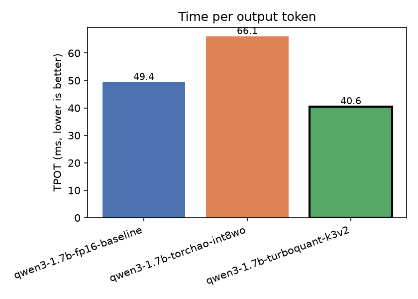
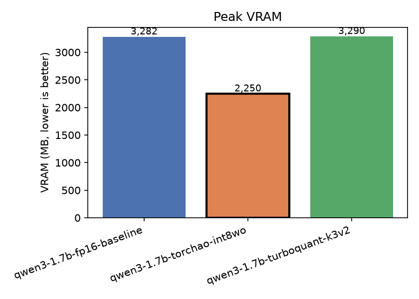
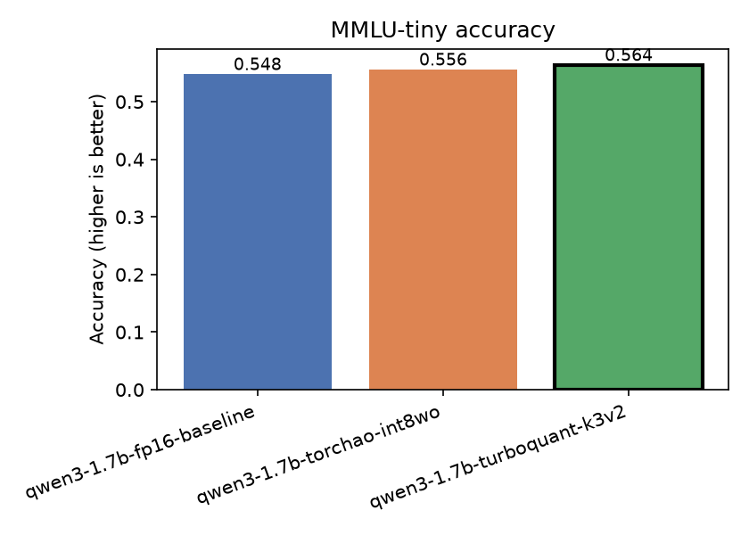

# Benchmark Report — Qwen3-1.7B (RTX 3060, 12GB)

Auto-generated by `python report.py --dir results/qwen3-1.7b-sweep`, then annotated
below with context the flattened table can't carry on its own. Regenerate with the
command above any time `results/qwen3-1.7b-sweep/` gets a fresh sweep — it always
picks the latest `comparison_summary_*.json`.

**Run:** `comparison_summary_20260717T152125Z.json` (2026-07-17)
**Environment:** this specific run predates the environment-capture feature
(commit `ad306be`, landed mid-session), so the auto-generated block below says
"not recorded." For the record: NVIDIA RTX 3060 (12288 MB), driver 610.62, CUDA
12.8, torch 2.8.0+cu128, transformers 4.55.4, Python 3.12.10, Windows 10. Every
sweep from this commit onward records this natively.

---

## The headline result: usable context length

The leaderboard table below reports VRAM at a *short* prompt — that's a resident-weights
snapshot (the benchmark measures memory before generation-heavy metrics run), and at
short context TurboQuant's KV cache hasn't accumulated enough compressed history to show
its advantage. **The real story is context-length capacity on a fixed 12GB card:**

| Model | Max usable context (this GPU) |
|---|---|
| fp16 baseline | 4,096 tokens |
| torchao int8wo | 8,192 tokens |
| **TurboQuant K3V2** | **16,384 tokens** |

TurboQuant reaches **4x** fp16's usable context on identical hardware. This is measured,
not estimated — each point is a real forward pass, and the sweep stops at the first
length that doesn't fit (see the Windows VRAM-oversubscription note in
[`failure_cases.md`](failure_cases.md) for why "doesn't fit" needed a real fix before this
number could be trusted).

---

## Leaderboard (short-context snapshot)

| Model | Runtime | Status | TTFT (ms) | TPOT (ms) | TPS | VRAM (MB) | Disk (MB) | PPL | MMLU |
|---|---|---|---|---|---|---|---|---|---|
| qwen3-1.7b-fp16-baseline | hf | success | 51.5 | 49.4 | 170.5 | 3281.8 | 3890.4 | 22.45 | 0.548 |
| qwen3-1.7b-torchao-int8wo | hf | success | 70.2 | 66.1 | 118.9 | 2249.5 | 3890.4 | 21.98 | 0.556 |
| qwen3-1.7b-turboquant-k3v2 | hf | success | 71.4 | 40.6 | 175.4 | 3290.4 | 3890.4 | 22.45 | 0.564 |

**Reading this table:**
- **torchao-int8wo VRAM** (2,250 MB vs fp16's 3,282 MB, -31%) is a real, straightforward
  weight-quantization win — int8 weights are half the bytes of bf16, minus embeddings/
  lm_head which stay unquantized.
- **turboquant-k3v2 VRAM** (3,290 MB, ~flat vs fp16) is *not* a null result — it's this
  metric being measured before the KV cache has grown enough to matter. See the context
  chart above for TurboQuant's actual memory story.
- **turboquant-k3v2 MMLU** (0.564) edging out fp16 (0.548) is noise, not a real quality
  improvement — MMLU-tiny's sample size is small enough that a ~1.6pp gap isn't
  meaningful, and there's no mechanism by which lossy KV compression should *improve*
  accuracy. Don't cite this as a finding.
- **PPL is bit-identical** between fp16 and TurboQuant (22.45 both) because perplexity is
  teacher-forced — every ground-truth token is fed back in, so the KV cache is never read
  during scoring. TurboQuant compresses the KV *cache*; a metric that never reads the
  cache can't see it. This is exactly why the bit-width tradeoff below uses **generation**
  (real decode, real cache reads), not perplexity.

## Verdicts

- **Best for latency:** `turboquant-k3v2` — 40.6ms TPOT (also the fastest of the three at
  this prompt length — the compressed-KV attention path isn't inherently slower here)
- **Best for memory (short context):** `torchao-int8wo` — 2,250 MB
- **Best for memory (long context):** `turboquant-k3v2` — see context chart above
- **Best for quality:** effectively tied (fp16/TQ identical PPL; MMLU gap is noise)

---

## TurboQuant: compression vs. quality tradeoff

This is the honest number for the showcased K3V2 default — kept in, not smoothed over.
Next-token agreement with the FP16 baseline, per KV bit-width, measured at the
*compressed-tail* positions only (the ring buffer's most recent 256 tokens stay exact
regardless of bit-width, so comparing those would trivially show 100% agreement and
tell you nothing about the codec).

| Bits | Context | Top-1 agree | Top-5 agree | KL div | KV MB | Compression |
|---|---|---|---|---|---|---|
| K2V2 | 512 | 0.094 | 0.266 | 6.6534 | 32.6 | 1.72x |
| K2V2 | 1024 | 0.094 | 0.266 | 5.7939 | 41.8 | 2.68x |
| K2V2 | 2048 | 0.156 | 0.281 | 6.4233 | 60.2 | 3.72x |
| K2V2 | 4096 | 0.125 | 0.297 | 5.7675 | 96.9 | 4.62x |
| K3V2 | 512 | 0.188 | 0.438 | 5.3793 | 33.5 | 1.67x |
| K3V2 | 1024 | 0.172 | 0.375 | 5.2478 | 44.4 | 2.52x |
| K3V2 | 2048 | 0.156 | 0.344 | 6.1257 | 66.3 | 3.38x |
| K3V2 | 4096 | 0.156 | 0.297 | 5.2631 | 110.0 | 4.07x |
| K4V4 | 512 | 0.328 | 0.625 | 3.5494 | 37.0 | 1.51x |
| K4V4 | 1024 | 0.250 | 0.453 | 4.0911 | 54.9 | 2.04x |
| K4V4 | 2048 | 0.156 | 0.375 | 4.9650 | 90.8 | 2.47x |
| K4V4 | 4096 | 0.281 | 0.438 | 4.1029 | 162.5 | 2.76x |
| K8V8 | 512 | 0.984 | 1.000 | 0.0042 | 44.0 | 1.27x |
| K8V8 | 1024 | 0.984 | 1.000 | 0.0039 | 75.9 | 1.48x |
| K8V8 | 2048 | 0.984 | 1.000 | 0.0038 | 139.8 | 1.60x |
| K8V8 | 4096 | 0.969 | 1.000 | 0.0028 | 267.5 | 1.67x |

**Reading this table:** value-bit precision is the dominant factor, not key-bit — K2V2 and
K3V2 score within noise of each other (both V2), while K4V4 (V4) is a clear step up.
K8V8 is near-lossless (~97-98% agreement) but only compresses 1.3-1.7x. This tradeoff
is reproducible: an independent sweep run a month earlier (2026-06-08) produced the same
shape. Root cause and the real fix (per-channel key quantization) are in
[`failure_cases.md`](failure_cases.md).

---

_Source: `results/qwen3-1.7b-sweep/` — 3 detail record(s) matched. Full experiment
history in [`experiments.md`](experiments.md)._
