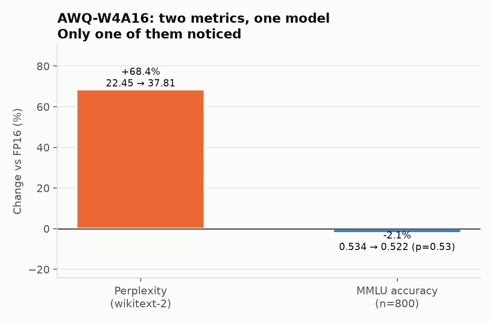

# Three times I measured nothing and didn't notice

Building a quantization benchmark, I shipped three claims that were wrong. Not off by a
bit — *structurally unsupported*. Each time the number was computed correctly, saved
correctly, and plotted correctly. Each time the metric was incapable of observing the
thing I used it to claim.

They're worth writing up together because they're the same mistake in three costumes, and
because the third one was sitting in a README I'd already called finished.

---

## 1. Perplexity cannot see KV-cache quantization

I built a KV-cache compression scheme, ran perplexity on the compressed and uncompressed
model, and got:

```
fp16:       22.449370186003648
compressed: 22.449370186003648
```

Sixteen matching decimals. I briefly believed I'd built a lossless codec.

**Perplexity is teacher-forced.** Every ground-truth token is fed back as input, and the
whole sequence scores in a single forward pass. Each position attends over a causal prefix
that's materialized fresh in that pass. The KV cache gets *written* and never *read back
across steps* — because there are no steps.

I compressed a cache the metric never reads. Bit-identical wasn't evidence of quality; it
was evidence the experiment was hollow. A codec that returned random noise would have
scored the same.

Fix: measure with actual multi-step generation, where step *t+1* attends to a cache
written at step *t*. Agreement dropped to 19% at aggressive settings. There was the signal.

---

## 2. Accuracy without its denominator

My leaderboard showed several quantized models *beating* their FP16 baseline on MMLU.
Quantization removing information and improving the model should have stopped me. It
didn't, because the eval returned this:

```python
return correct / total   # a bare float
```

The denominator died at the return statement. Nothing downstream — not the results JSON,
not the table, not the doc — knew that `total` was **250** (5 subjects × 50, hardcoded).

At n=250, binomial SE is ±3.1pp and the 95% CI is ±6.2pp. So:

| Reported | What it actually was |
|---|---|
| +0.8pp "improvement" | **2 questions out of 250** |
| +1.6pp "improvement" | 3 questions |
| −3.2pp "AWQ regression" (I wrote this up as a finding) | 8 questions, ~1 SE |

I hadn't measured a quality difference in either direction. I'd measured a coin.

### The fix, and the better tool

Three changes: the eval now returns `{acc, correct, total, stderr, per_question}` — a
metric that carries its own sample size can't hide this; the count became config-driven and
went to n=800; and because every model answers *identical* questions, the right test is
**McNemar's exact test** on the discordant pairs, not two independent proportions.


Re-run at n=800, only one delta survives:

| Model | Δ | broken / fixed | p | |
|---|---|---|---|---|
| GPTQ-W8A8 | +0.9pp | 7 / 14 | 0.19 | noise |
| AWQ+TurboQuant | −0.1pp | 80 / 79 | 1.00 | noise |
| AWQ-W4A16 | −1.1pp | 86 / 77 | 0.53 | noise — **my finding, retracted** |
| torchao int4wo | −9.9pp | 172 / 93 | **<0.0001** | real |

The discordant counts turned out more interesting than the deltas. AWQ changes **163 of
800 answers** — 20% of the benchmark — but *symmetrically*: 86 broken, 77 fixed, net
nothing. The model's behaviour shifted substantially while accuracy didn't move. int4wo
changes 265 *asymmetrically* (172/93) — that's real degradation. Same "4-bit weights"
label, completely different mechanism, and plain accuracy shows you neither.

### And the metric that *did* see it

The same AWQ checkpoint MMLU couldn't resolve:



Perplexity moved **+68%**. It wasn't that the damage was subtle. It's that multiple-choice
accuracy is a coarse instrument — a question flips only when the perturbation crosses a
decision boundary between four options. Perplexity integrates error over every token and
the full vocabulary distribution.

Note this is the *exact inverse* of failure #1: there, PPL was blind and generation saw
it. Here, PPL sees it and accuracy is blind. Neither metric is better. They have different
blind spots, and you need to know which one you're standing in.

---

## 3. A memory probe says nothing about quality

The headline on my README:

> **TurboQuant K3V2 reaches 16,384 tokens — 4x fp16's 4,096.**

True. Also close to meaningless, and I'd shipped it as the project's lead result.

The function producing it records `kv_cache_mb`, `peak_vram_mb`, `fits`. **There is no
accuracy field in it.** It answers "does the cache fit in VRAM" and is structurally
incapable of answering "is the output any good at that length."

Meanwhile the one metric that *did* pair quality with context stopped at 4,096 — below the
claim — and compared 64 positions per point (~5pp SE), so its trends were smaller than
their own error bars.

**The claim's context range and its quality range never overlapped.** Nothing flagged it,
because no single number was wrong.

Extending quality measurement to the same 16,384, at 512 positions:


| Setting | Max context | Agreement @16K | KV compression |
|---|---|---|---|
| fp16 | 4,096 | — | 1.0x |
| **K8V8** | **16,384** | **0.918** | 1.73x |
| K3V2 *(what I showcased)* | 16,384 | **0.193** | 4.81x |

The 4x survived — attached to the wrong configuration. K8V8 delivers identical capacity
*with quality intact*. K3V2's extra compression buys **no additional context on this card**
and costs 80% of fidelity. I had been leading with the strictly worse of two options I'd
already measured.

Two bonuses from finally sweeping both axes: the quality cliff is sharp between K4V4 and
K8V8, not gradual — the "aggressive compression" band is mostly unusable on this model.
And agreement doesn't decay with context at *any* bit-width (K3V2 is equally poor at 512),
so the constraint was never long context. It was the bit budget.

---

## The pattern

| Claim | Metric used | Why it couldn't see it |
|---|---|---|
| "KV compression is lossless" | teacher-forced PPL | never reads the cache back |
| "quantization improved accuracy" | bare accuracy ratio | denominator discarded; n=250 |
| "4x usable context" | memory-capacity probe | has no accuracy field at all |

Every one produced a plausible number. None was a wrong calculation. The failure was
upstream of arithmetic: **a mismatch between what the metric observes and what the
sentence asserts.**

Three habits that would have caught all three, cheaply:

1. **Say the claim and the mechanism out loud, together.** "Compression is lossless,
   measured by a metric that reads the compressed data" — the second clause is where it
   dies. If you can't state the mechanism, you don't have evidence.
2. **Make metrics carry their own sample size.** A bare ratio is an unfalsifiable number.
   `correct/total` plus a CI would have made the noise self-evident with no statistics
   knowledge required.
3. **When a result flatters you, treat it as a bug report.** A quantized model beating its
   baseline, a lossy codec scoring identical, a capacity number with no quality cost —
   each was the null hypothesis knocking. I heard it as good news three times.

The uncomfortable part: these all survived a review pass where I checked every number
against raw JSON and found them accurate. They *were* accurate. Verification of values is
not verification of claims.

---

*From [TripleQuant-VLM](https://github.com/ramprasathk07/TripleQuant-VLM). Full write-ups with reproduction
commands in `docs/failure_cases.md` (#4, #9, #10); the paired test is
`scripts/mmlu_significance.py`. Qwen3-1.7B on an RTX 3060.*
