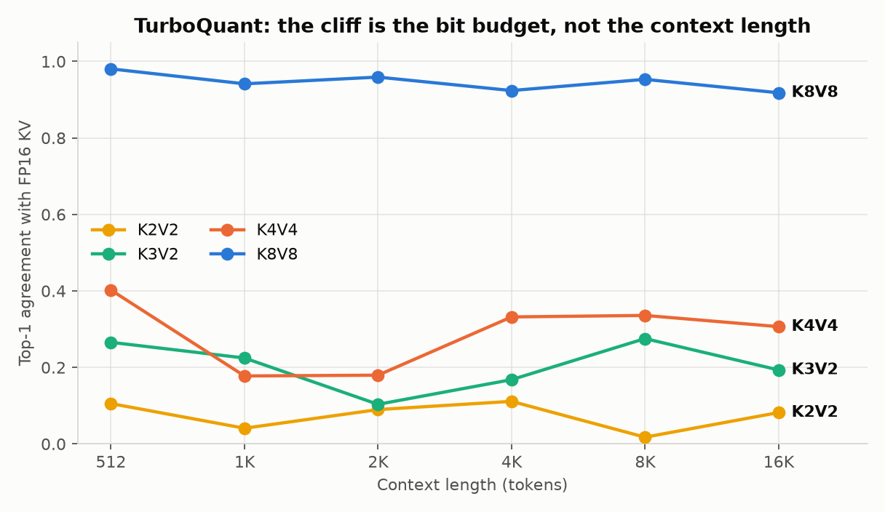

# KV-cache compression: 4x the context, and what it actually costs

Weight quantization shrinks the thing that's constant. The KV cache is the thing that
*grows* — and at long context it's what pushes you off the GPU.

I built a KV-cache codec (TurboQuant: random rotation + Lloyd-Max codebook), measured it
properly on an RTX 3060, and got a 4x context win. The interesting part is that my first
answer about *which configuration* delivers it was wrong, and the measurement that
corrected it is one most projects don't run.

---

## Why the KV cache is the right target

Per token, per layer, the cache stores keys and values for every previous token:

```
KV bytes = layers × kv_heads × head_dim × 2 (K,V) × 2 (bf16) × seq_len
```

For Qwen3-1.7B that's ~112 KB per token. Weights are fixed at 3.3 GB; the cache is
unbounded in sequence length. Quantize weights to 4-bit and you save 2 GB once —
worthwhile, and it does nothing about the term that grows.

TurboQuant's approach, briefly: apply a fixed random orthogonal rotation to each key/value
vector, which flattens outlier channels into a roughly Gaussian distribution; then quantize
with a Lloyd-Max codebook optimized for exactly that distribution. Rotation preserves inner
products, and inner products are all attention consumes. Recent tokens stay exact in a ring
buffer; older ones get compressed.

---

## Measuring it correctly

Two traps, both of which I fell into first.

**Perplexity can't see this at all.** PPL is teacher-forced — one forward pass, no
cross-step cache reads. My compressed and uncompressed models scored *bit-identical* PPL to
16 decimals. That's not a lossless codec, that's a metric that never touched the cache.

The metric that works: run real multi-step generation and compare next-token predictions
against an FP16-cache baseline on identical inputs. **Top-1 agreement** — how often does
the compressed model pick the same token?

**And you must sweep quality across the same context range as your capacity claim.** My
capacity probe ran to 16,384 tokens. My quality probe stopped at 4,096. The claim's two
axes never overlapped, and nothing complained.

---

## The result

512 comparison positions per point, context 512 → 16,384:



| Bits | Agreement @512 | @16K | KV compression @16K |
|---|---|---|---|
| K2V2 | 0.105 | 0.082 | 5.65x |
| K3V2 | 0.266 | 0.193 | 4.81x |
| K4V4 | 0.402 | 0.307 | 3.02x |
| **K8V8** | **0.981** | **0.918** | 1.73x |

**The cliff is sharp.** Not a gradual quality-per-bit slope — everything below 8 bits sits
under 40% agreement, and 8-bit sits at 92%. On this model the "aggressive compression"
band is essentially unusable, and there's no fine-tuning your way to a middle ground: K4V4
is closer to K2V2 than to K8V8.

**Agreement doesn't decay with context.** K3V2 is as poor at 512 tokens as at 16K. I
expected compounding error over a longer compressed history; there isn't any. The
constraint is the bit budget, full stop. That's a useful negative result: it means you
don't need to re-validate a bit-width when you extend context.

---

## The correction: capacity alone doesn't pick your config

Context capacity on the same 12 GB card:

| | Max context | Agreement @16K |
|---|---|---|
| fp16 | 4,096 | — |
| K3V2 | 16,384 | 0.193 |
| **K8V8** | **16,384** | **0.918** |

**Both reach 16,384.** The 4x is real either way — so capacity, the number I was leading
with, doesn't distinguish the two configurations at all. Only the quality column does.

K3V2 compresses the cache 2.8x harder than K8V8 and converts none of that into usable
context, while giving up 80% of its fidelity. It's dominated: same capacity, far worse
output. I had been showcasing it as the flagship setting for weeks, on the strength of a
compression ratio that bought nothing.

Why doesn't 4.81x compression beat 1.73x on capacity? Because the KV cache isn't the only
thing scaling — activations and the logits tensor grow with sequence length too. Past a
point, shrinking KV further stops moving the ceiling. **The compression ratio was never
the goal; it was a proxy I forgot to check against the real objective.**

---

## Where the low-bit quality actually goes

The failure is in the keys, not the values, and it's structural. The quantizer treats each
key vector independently with one global codebook. But transformer keys have a handful of
large-magnitude *channels* — the same outlier phenomenon SmoothQuant and AWQ correct for in
weights. A uniform codebook spends bits on channels that don't need them and starves the
ones that do.

Supporting evidence from the same sweep: K2V2 and K3V2 score within noise of each other
(both 2-bit values), while K4V4 jumps — value-bit precision moves the needle where the
extra key bit doesn't.

The known fix is per-channel key quantization (KIVI's approach: keys per-channel, values
per-token). That's a quantizer redesign, not a wiring change, and it's not done here.

One thing I checked and discarded along the way: TurboQuant includes an optional QJL 1-bit
residual correction that should make the inner-product estimate unbiased. Measured
directly, it produces **identical** scores to dequantize-then-matmul — algebraically
equivalent for a fixed random projection. Its benefit is variance reduction in expectation
over *resampled* projections, and this implementation fixes the projection once for speed.
Worth measuring a fix's premise before building on it.

---

## If you're evaluating a KV codec

1. **Use generation-based agreement, not perplexity.** PPL structurally cannot see
   cross-step cache error.
2. **Sweep quality over the full range you plan to claim.** Capacity at 16K plus quality
   at 4K is not a result about 16K.
3. **Report the compression ratio *and* the capacity it actually buys.** They decouple
   once other memory terms dominate — mine decoupled completely.
4. **Check for outlier channels before blaming the bit budget.** Per-vector quantization on
   keys is a known trap with a known fix.

The honest summary of my own result: **4x context at 92% agreement (K8V8) is a real,
useful win. 4x context at 19% agreement is a number, not a result** — and telling those
apart required measuring quality on the same axis as the claim.

---

*From [TripleQuant-VLM](https://github.com/ramprasathk07/TripleQuant-VLM) — Qwen3-1.7B, RTX 3060 12 GB.
Algorithm in `notes/turboquant.md`, the correction in `docs/failure_cases.md` #10, raw
results under `results/`. Caveat carried in the repo: "max context" is what a single
full-prefill pass fits, and that peak is dominated by the logits tensor rather than the KV
cache — valid as a relative comparison under an identical probe, not a serving figure.*
